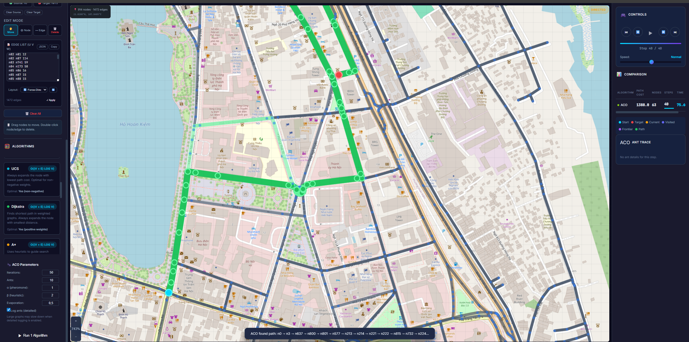
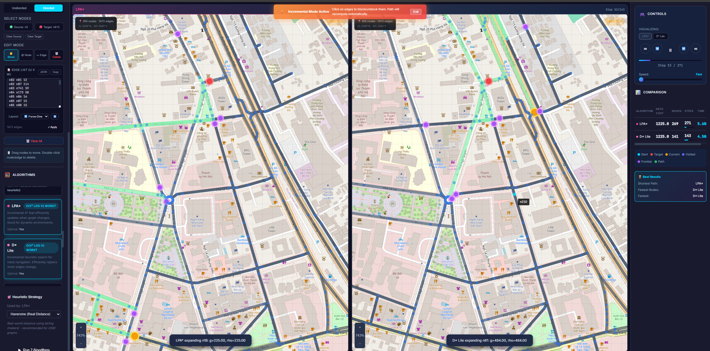

# intro-ai-20251

Dự án webapp trực quan hóa các thuật toán tìm đường và tìm kiếm. Hỗ trợ chỉnh sửa đồ thị, chạy/so sánh nhiều thuật toán theo từng bước, và tùy chọn tải dữ liệu đường phố thực từ OpenStreetMap (OSM).

## Tính năng chính
- Trực quan hóa thuật toán tìm đường theo từng bước (play/pause/step).
- So sánh nhiều thuật toán cùng lúc.
- Chỉnh sửa đồ thị (thêm/xóa node, edge, đổi trọng số, block cạnh).
- Hỗ trợ đồ thị mẫu, bản đồ thành phố mô phỏng, và OSM thật (tùy chọn).
- Tùy chỉnh heuristic, tham số ACO, Local Beam Search, DLS...

## Cấu trúc thư mục
- `webapp/`: frontend React + Vite.
- `webapp/src/algorithms/`: cài đặt các thuật toán.
- `webapp/backend/`: backend Flask + OSMnx (tải dữ liệu OSM).
- `requirements.txt`: thư viện Python phục vụ notebook/demo.

## Yêu cầu
- Node.js 18+ (khuyến nghị 20+).
- Python 3.9+ (chỉ cần khi chạy backend OSM).

## Cách chạy

### 1) Chạy webapp (frontend)
```bash
cd webapp
npm install
npm run dev
```
Mở trình duyệt tại: `http://localhost:5173`

### 2) Chạy backend OSM (tùy chọn)
```bash
cd webapp/backend
pip install -r requirements.txt
python server.py
```
Backend chạy tại: `http://localhost:5000`  
Sau đó vào tab OSM trong webapp để tải dữ liệu bản đồ thật.

## Screenshots
<!-- (sẽ cập nhật sau) -->




<!--  -->
[](https://drive.google.com/file/d/1dsSUVKZWpTT4x4lsrr-ZTmg14rdWG4ln/preview)
<!-- <iframe src="" width="640" height="480"></iframe> -->

## Ghi chú
- Nếu không chạy backend OSM, bạn vẫn có thể dùng các đồ thị mẫu.
- Lần đầu tải OSM có thể chậm do OSMnx cần tải và cache dữ liệu.
